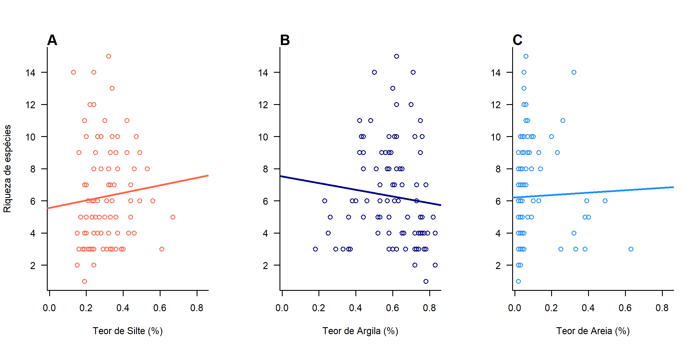
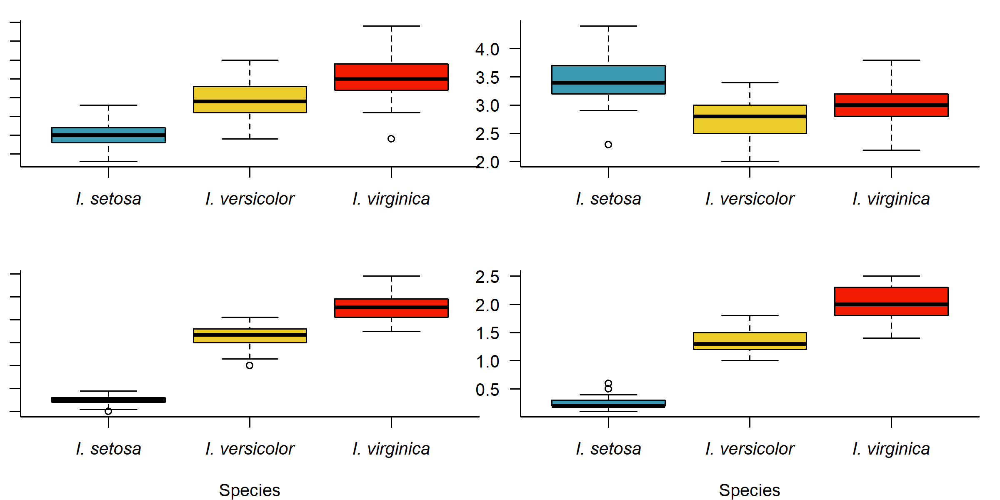
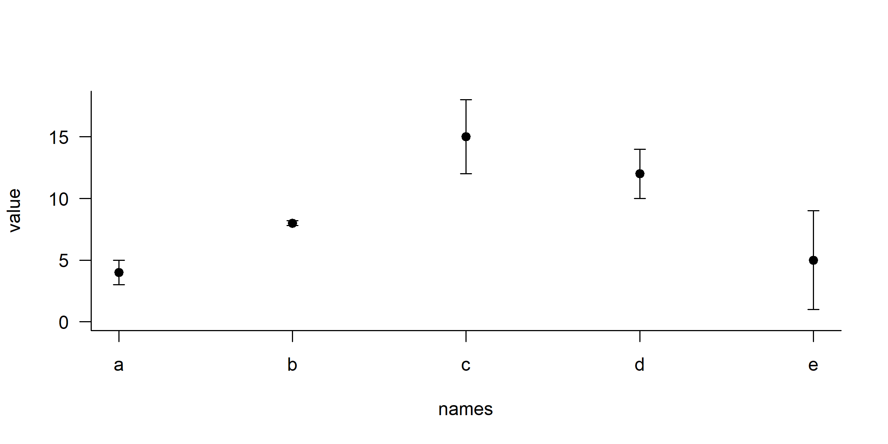

#esse setup é default do markdown para todo o arquivo.
```{r setup, include=FALSE}
knitr::opts_chunk$set(echo = TRUE)
```

## R Markdown

#```{r setup, echo=FALSE}
#só apertar ctrl+alt+I pra aparecer isso aqui. echo = F não aparece no arquivo. eval = F não roda o script. Pode rodar e apareder ou pode rodar e não aparecer
#```


This is an R Markdown document. Markdown is a simple formatting syntax for authoring HTML, PDF, and MS Word documents. For more details on using R Markdown see <http://rmarkdown.rstudio.com>.

When you click the **Knit** button a document will be generated that includes both content as well as the output of any embedded R code chunks within the document. You can embed an R code chunk like this:

```{r cars}
summary(cars)
```

## Including Plots

You can also embed plots, for example:

```{r pressure, echo=FALSE}
plot(pressure)
```

Figure01 created during exercise number 7 


Figure 02 created during exercise number 7
```{r figura_2, echo=FALSE}

```

Figure03 created during exercise number 7 



Note that the `echo = FALSE` parameter was added to the code chunk to prevent printing of the R code that generated the plot.
